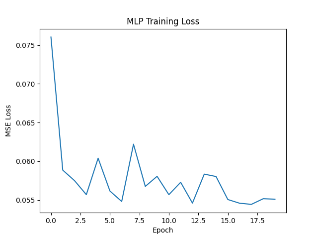
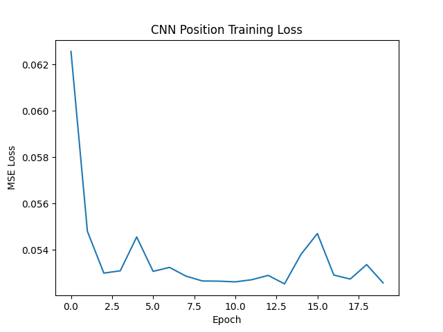
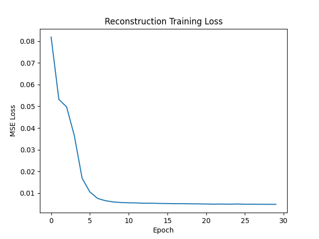
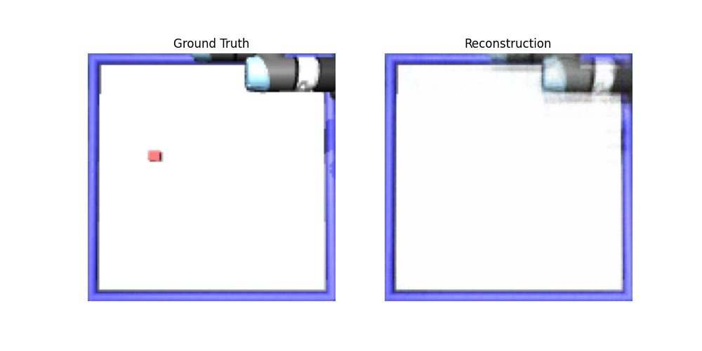

# CMPE591 Assignment 1: Object Position Prediction & Image Reconstruction

## 1. MLP Position Prediction (Deliverable 1)
*   **Test MSE Loss:** 0.053009

**Training Loss Curve:**

---

## 2. CNN Position Prediction (Deliverable 2)
*   **Test MSE Loss:** 0.052528

**Training Loss Curve:**

---

## 3. Image Reconstruction (Deliverable 3)
*   **Test MSE Loss:** 0.004831

**Training Loss Curve:**

**Reconstruction vs. Ground Truth:**

